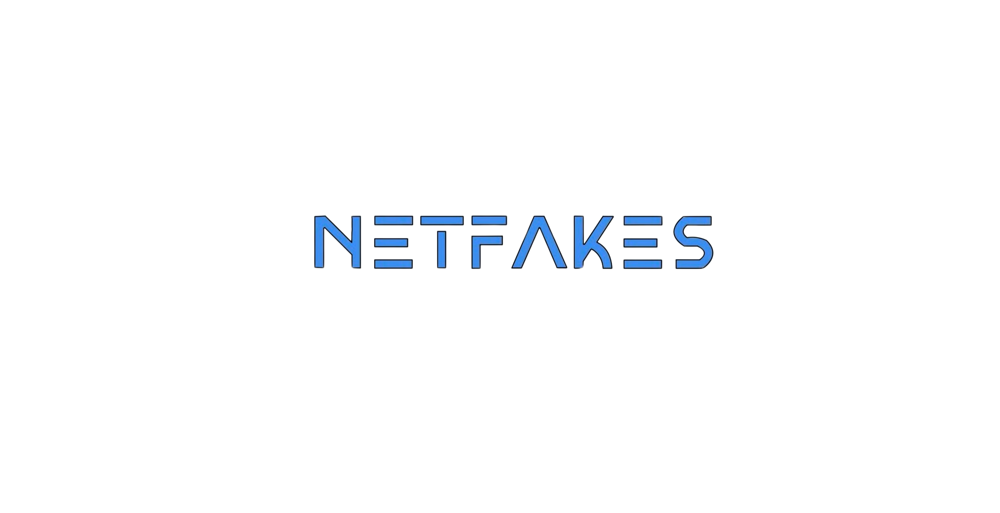
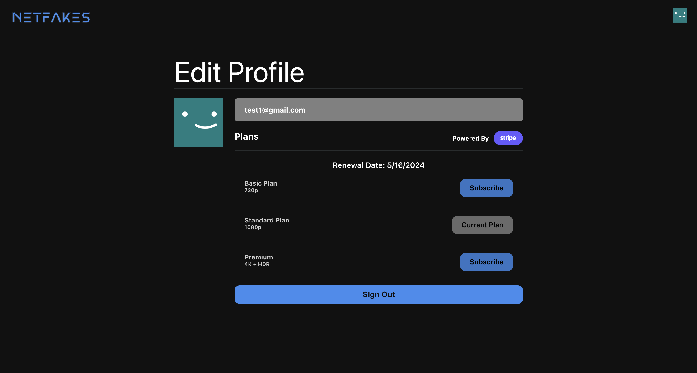
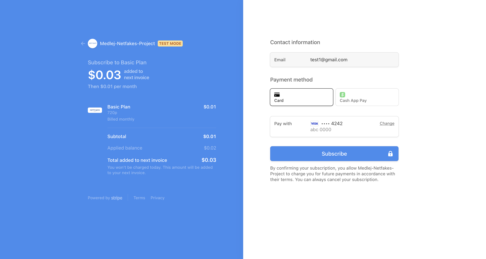

# NetFakes: A Dynamic Netflix Clone

## Live Link

[Visit NetFakes](https://netfakes-d4679.web.app/) - Dive into the project and have fun!

## Project Description

NetFakes is a full-fledged Netflix clone built to demonstrate advanced web development skills. This project mimics the core functionalities of Netflix, featuring user authentication, subscription management, and a responsive, intuitive UI. Users can sign up, choose subscription plans, and browse through a variety of media offerings just like they would on Netflix.

## Tech Stack

- **Frontend:**

   

- **State Management:**

  

- **Backend:**

  

- **Payment Processing:**

  

## Guide

- Register using any email and password (secure authentication through Firebase).
- You're in!
- Subscribe to any plan (DO NOT use real credit cards).
  Follow on-screen instructions for a successful subscription.
- Enjoy!

## Showcase

_NetFakes Home Screen - Signed Out_

 

_NetFakes Home Screen - Signed In_

 

_Choosing a Subscription Plan_

 

_Stripe Payment Checkout_
